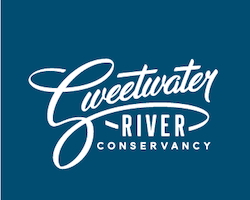

# SweetwaterCredits
#### Mobile app source code for the Sweetwater River Conservancy. App users can calculate the amount of credits they have on a plot of land by filling out the forms in the app.

**Build Status**

* Staging- > here
* Production- > here

**Project Stack**

* **ReactNative** (Typescript/ES6)

**How To Get Started**

* Assuming you're doing this on OSX and trying to run iOS  
* Install Node and watchman

```
$ brew install node
```

```
$ brew install watchman  
```

* Install ReactNative Command Line Tools

```
$ npm install -g react-native-cli  
```

* Run the App

```
$ cd sweetwaterCredits  
```

```
$ react-native run-ios   
```


**Andrew Vogel 2016**


